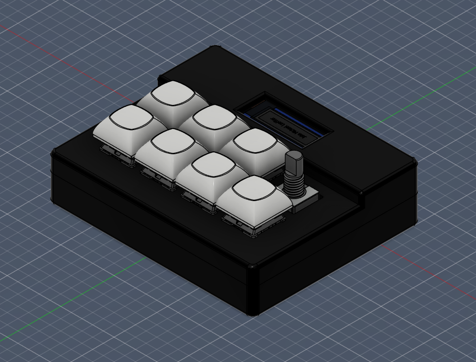
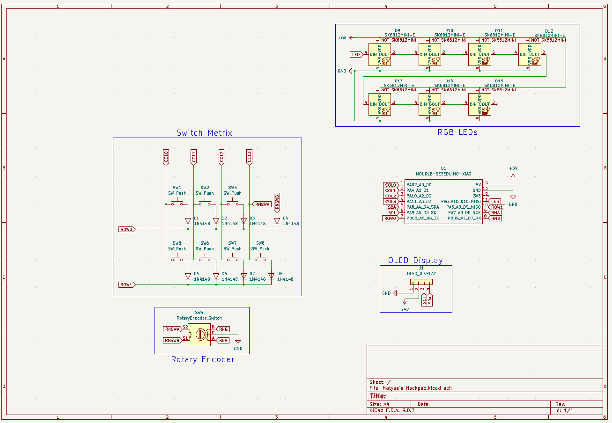
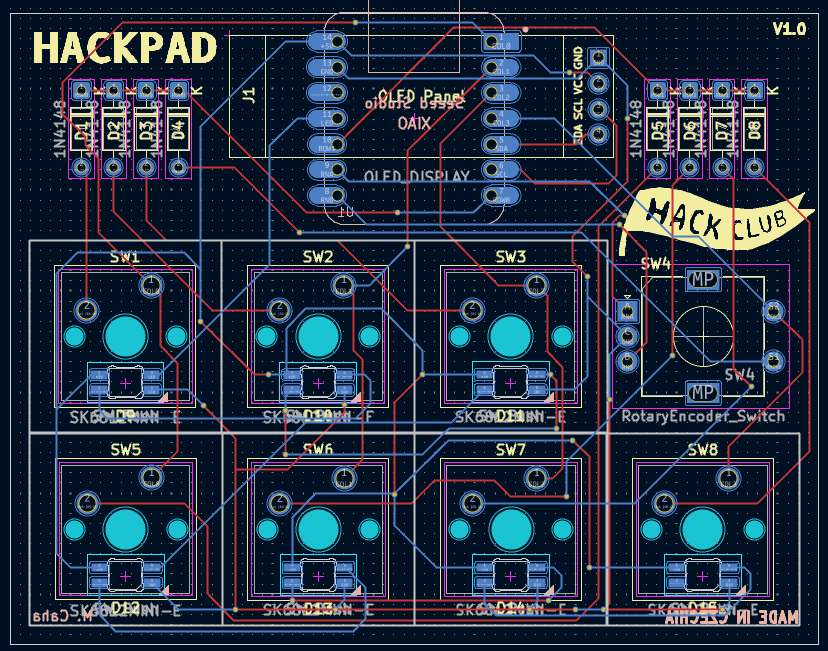
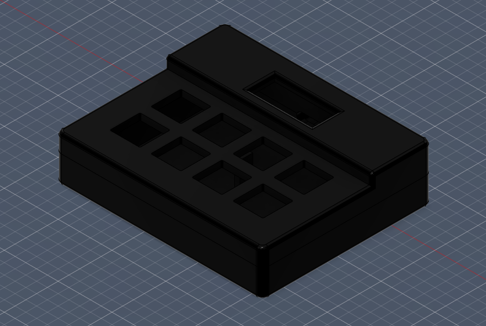

# Matyas-s-Hackpad
It has 8 keys (7 switches + rotary encoder switch), a rotary encoder, and an OLED display. Each key is backlit with SK6812 MINI-E LEDs. It uses [QMK](https://qmk.fm/) firmware.

## CAD Model:
Everything is connected by four M3x16mm screws and M3x5mx4mm heatset inserts. The case is printed in two parts, top and bottom.

  

  <strong>Made in Fusion360</strong>

## PCB:

  Schematic

  

 

  PCB

  

  <strong>Made in KiCad</strong>

## Case:

  

  <strong>Made in Fusion360</strong>

## Firmware:
This Hackpad uses [QMK](https://qmk.fm/) firmware. The rotary encoder changes the volume, and the keys are just numbers for now, but I'll fix that later. 
I plan to add VIA support in the future.

## BOOM:
Here is everything you need to create this Hackpad:
| Component | Amount |
| :--- | :---: |
| **Seeed XIAO RP2040** | 1x |
| **MX-Style switches** | 7x |
| **1N4148 Diodes** | 8x | 
| **EC11 Rotary encoder** | 1x |
| **0.91 inch OLED display** | 1x |
| **DSA keycaps** | 7x |
| **SK6812 MINI-E LED** | 7x |
| **M3x16mm screw** | 4x |
| **M3x5mx4mm heatset insert** | 4x |
| **Case** (2 printed parts) | 1x |
